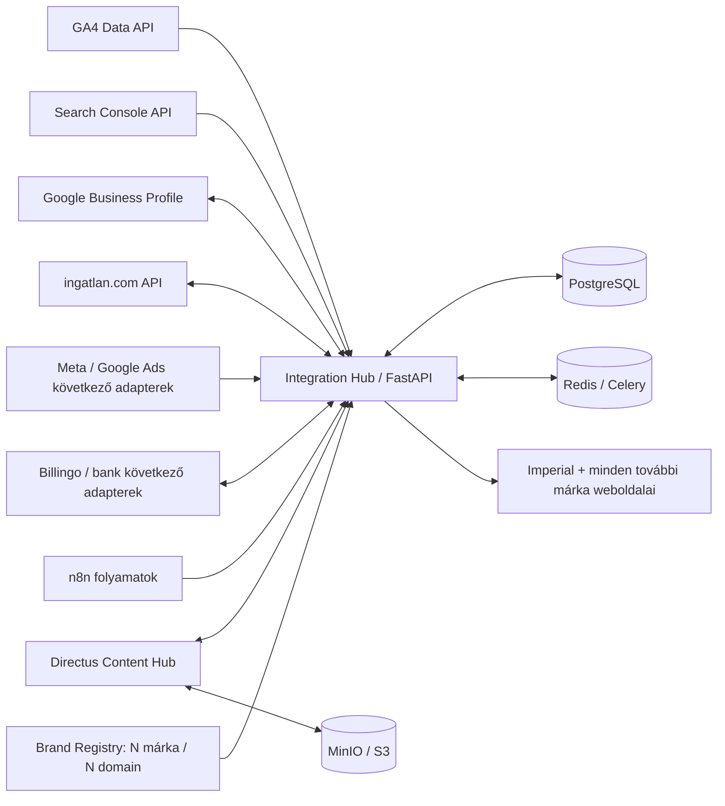
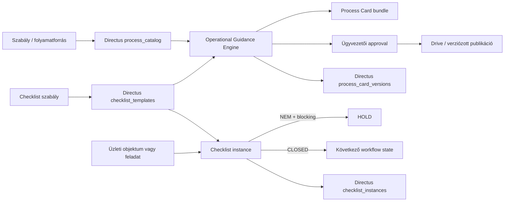

# Imperial Intelligence – integrációs architektúra

## Cél

A külső rendszerek egy központi vezérlési ponton keresztül kapcsolódnak. Az adapterek el vannak választva az Imperial üzleti logikájától, így egy szolgáltatói API-változás nem kényszeríti az egész rendszer újraírását.



## Analitika

1. Celery Beat naponta indítja a GA4, Search Console és Business Profile szinkronokat.
2. Az adapterek egységes `MetricRow` rekordokat adnak vissza.
3. A dimenziók hash-e és a dátum alapján a mentés idempotens.
4. Minden futás külön `integration_runs` naplórekordot kap.
5. A GBP account-, location- és review-adatok külön normalizált táblákba kerülnek.

## ingatlan.com

1. Az Imperial saját ingatlanadata az elsődleges adatforrás.
2. A connector JWT-tokenes bejelentkezést és 401 utáni egyszeri tokenfrissítést végez.
3. A `PUT /ads/{ownId}` upsert művelet.
4. A képek külön végpontokon, base64 tartalommal kerülnek fel.
5. A saját ID, távoli ID, státusz, checksum és payload naplózódik.
6. Az időzített ID-szinkron nem töröl automatikusan hirdetést; a destruktív egyeztetés külön jóváhagyást igényel.

## Weboldali tartalom

A márka- és weboldallista konfigurációból töltődik, nem a programkódba van beégetve. Egy márkához tetszőleges számú domain, aldomain vagy nyelvi webhely rendelhető.

1. A tartalom Directusban készül és emberi jóváhagyást kap.
2. A Directus Flow meghívja a Hub webhookját.
3. A Hub nem bízik meg vakon a webhook payloadban: visszaolvassa a teljes rekordot Directusból.
4. Egy publikációs batch minden céloldalhoz külön jobot kap.
5. A Hub HMAC-aláírt eseményt küld az oldalaknak.
6. A weboldal ellenőrzi az aláírást, majd frissíti a cache-t vagy a helyi read-modelt.
7. A tartalom csak az egész batch sikere után lesz `published`.
8. A `valid_until` után unpublish batch indul, majd a tartalom `archived` lesz.

## Biztonsági határok

- titok nem kerül forráskódba vagy tartalmi mezőbe;
- Google kulcs read-only secretként csatolandó;
- GBP refresh token külön secret;
- weboldalanként eltérő HMAC-kulcs;
- ötperces replay-védelem;
- az oldali endpoint nem futtat tetszőleges kódot;
- ár, határidő, garancia és jogi állítás csak `approved` rekordból mehet ki;
- ingatlan.com élesítés előtt kötelező az `apitest` validáció;
- automatikus hirdetéstörlés nincs bekapcsolva.

## Következő adapterek

- Meta Marketing API és Lead Ads webhook;
- Google Ads API;
- Billingo V3;
- bank/open banking;
- Gmail, Drive és Calendar;
- telefonközpont;
- projektmenedzsment és ügyfélportál.

## Operational Guidance Engine

A Process Card és a checklist nem két külön rendszer. Ugyanabból a Directus `process_catalog` és `checklist_templates` forrásból, ugyanazzal a ProcessID–GateID–verzió kapcsolattal működnek.



A helyi JSON-tár a fejlesztői és offline runtime. Élesben a központi Directus-rekordok az adatgazdák; a Drive csak a jóváhagyott, ember által olvasható artefaktumok publikációs tárhelye.

### Események

- Directus process/checklist változás → webhook → import → checksum-összevetés → érintett draft újragenerálása;
- CRM/projekt/pénzügyi/marketing folyamat indul → checklist-példány létrehozása az ObjectID-hoz;
- blocking NEM → HOLD és nincs továbblépés;
- evidence + kitöltés + jóváhagyás → CLOSED és a workflow továbbhaladhat;
- 15 perces Celery-feladat pótolja az esetleg elveszett webhookot.

## v0.7.0 production control layer

```text
Human/API client
   │ Bearer token + Idempotency-Key + Request-ID
   ▼
FastAPI authorization and request controls
   ├── exactly five human roles
   ├── separate machine service identities
   ├── manager-only approval
   ├── role-bound checklist execution
   └── request-size / trusted-host / CORS controls
   ▼
Operational Guidance Engine
   ├── Process Card generator
   ├── Checklist Engine
   ├── HOLD/CLOSED gate
   └── idempotency registry
   ▼
Directus / PostgreSQL / Drive / Gmail

Parallel control path:
request → structured log → audit_events → operations/audit/recent
request → Prometheus counters/histograms → protected /metrics
```

A service identity nem üzleti munkakör. Az emberi felelősség és jóváhagyás mindig az öt munkakör egyikéhez kötődik. A gépi integráció csak a számára engedélyezett technikai műveletet indíthatja; jóváhagyást nem végezhet.
