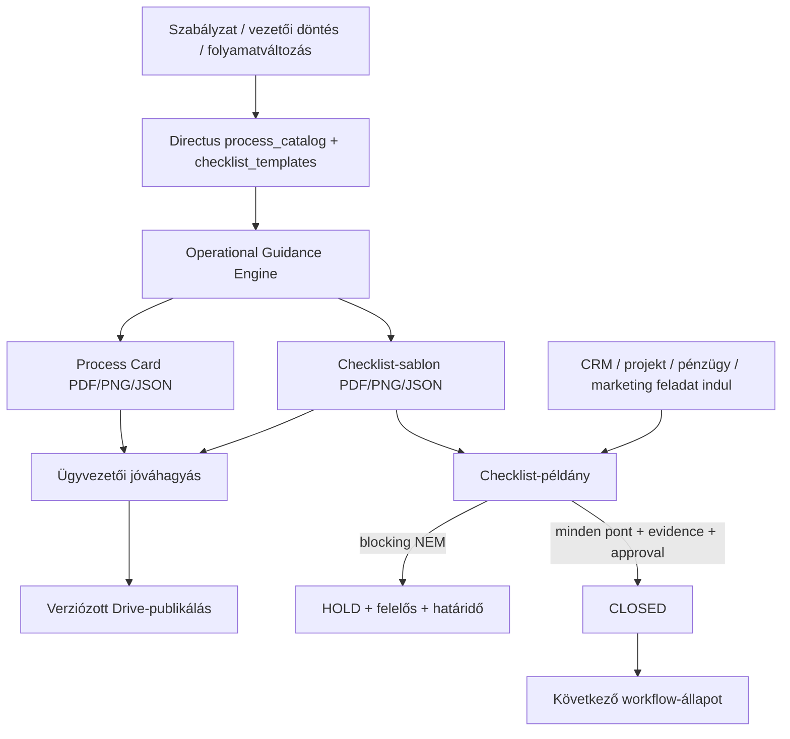

# Imperial Operational Guidance Engine v0.5.0

## Szerepe

Az Operational Guidance Engine a központi folyamatmodell és a napi végrehajtás közötti réteg. Egyetlen kanonikus `ProcessID` alapján kezeli:

- az emberi nyelvű Process Cardot;
- a kötelező operatív checklist-sablont;
- a konkrét ügyhöz, projekthez vagy feladathoz létrehozott checklist-példányt;
- a továbbhaladást engedő vagy blokkoló `GateID` állapotát;
- a jóváhagyást, verziózást, bizonyítékokat és auditnaplót.

A Process Card elmondja, **hogyan kell dolgozni**. A checklist bizonyítja, hogy **az adott ügyben valóban megtörtént minden kötelező ellenőrzés**.

## Kanonikus adatfolyam

## Egységes azonosítók

Minden folyamatcsomag ugyanazokat az azonosítókat használja:

- `process_key` / `ProcessID` – a folyamat kanonikus kulcsa;
- `checklist_template_id` – a folyamathoz tartozó checklist;
- `gate_id` – a workflow továbbhaladási kapuja;
- `object_id` – az a konkrét lead, szerződés, projekt, számla vagy más objektum, amelyen a folyamat fut;
- `version` – a szabály- és megjelenítési verzió;
- `EvidenceID` – a lezárást alátámasztó bizonyíték.

Párhuzamos folyamat- vagy checklist-adatbázis létrehozása tilos. A fájlrendszer csak helyi runtime/cache és auditálható artefaktumtár; az éles adatgazda a Directus.

## Öt valós munkakör

A motor kizárólag az alábbi munkaköröket oszthatja ki:

1. Ügyvezető
2. Marketinges
3. Értékesítő
4. Pénzügyes
5. Projektmenedzser

Jogi, HR-, beszerzési, minőségügyi, HSE-, IT- vagy auditfeladat nem hoz létre új belső szerepet: a család- és kulcsszavas szabályok alapján az öt valós munkakör egyikéhez kerül.

## Verzió- és változáskezelés

A Process Card-verzió lenyomata a folyamatforrás és a hozzá kapcsolt checklist-sablon közös SHA-256 értékéből készül. Emiatt az alábbi változások bármelyike új draftot indít:

- folyamatlépés, bemenet, kimenet vagy STOP-feltétel változása;
- felelős munkakör vagy jóváhagyó változása;
- checklistpont, evidence-elvárás vagy blocking szabály változása;
- `GateID`, sablonverzió vagy kapcsolódó szabály változása.

Változatlan forrásból nem készül új verzió. Az új verzió mindig új ügyvezetői jóváhagyást igényel.

## Futás közbeni kapulogika

- `OPEN`: a checklist kitöltése folyamatban van;
- `HOLD`: legalább egy blocking pont `NEM`, ezért nincs továbbhaladás;
- `READY_FOR_APPROVAL`: minden kötelező pont kitöltött, a bizonyítékok megvannak;
- `CLOSED`: a kijelölt jóváhagyó lezárta, a workflow továbbhaladhat.

`NEM` válasznál kötelező a megjegyzés, az öt valós munkakör valamelyikéből kijelölt felelős és a javítási határidő. `N.A.` válasznál kötelező az indoklás.

## Automatikus indítás

A motor három módon kapcsolódik a működéshez:

1. **Directus webhook:** szabályváltozáskor importál és csak az érintett csomagokat generálja újra.
2. **Celery safety-net:** 15 percenként összeveti a kanonikus forrást a helyi verzióval.
3. **Üzleti esemény:** CRM-, projekt-, pénzügyi vagy marketingfeladat indulásakor checklist-példányt nyit az adott `object_id`-hoz.

Az n8n referenciamunka: `n8n/imperial-operational-guidance-workflow.json`.

## Jóváhagyási üzembiztonság

A generált draft PDF/PNG fájlok a Drive `00_JÓVÁHAGYÁSRA_VÁR` ágába kerülnek, ezért az ügyvezető e-mailben közvetlenül megnyitható linkeket kap. Jóváhagyás után a rendszer idempotensen publikál a `01_ÉRVÉNYES` ágban, a review-mappát pedig a `99_JÓVÁHAGYÁSI_ARCHÍVUM` alá mozgatja. Sikertelen e-mail-küldésnél a jóváhagyási rekord nem vész el; a Celery ötpercenként újrapróbálja.

Az API és a worker közös Docker-volume-ot használ, a generálás folyamatonként zárolt és a JSON-írás atomi. Ez megakadályozza, hogy a webhook és a periodikus ellenőrzés ugyanabból a változásból két verziót hozzon létre.
